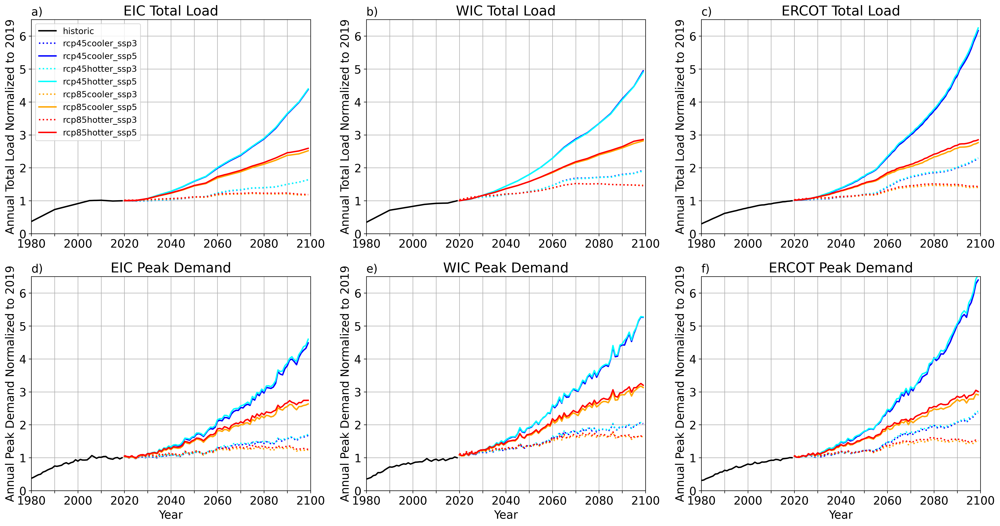
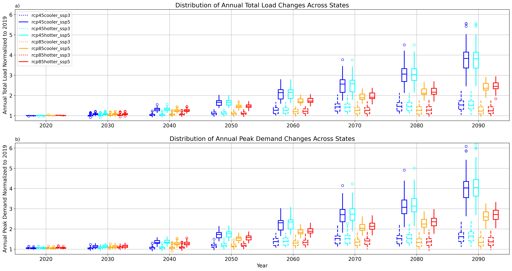
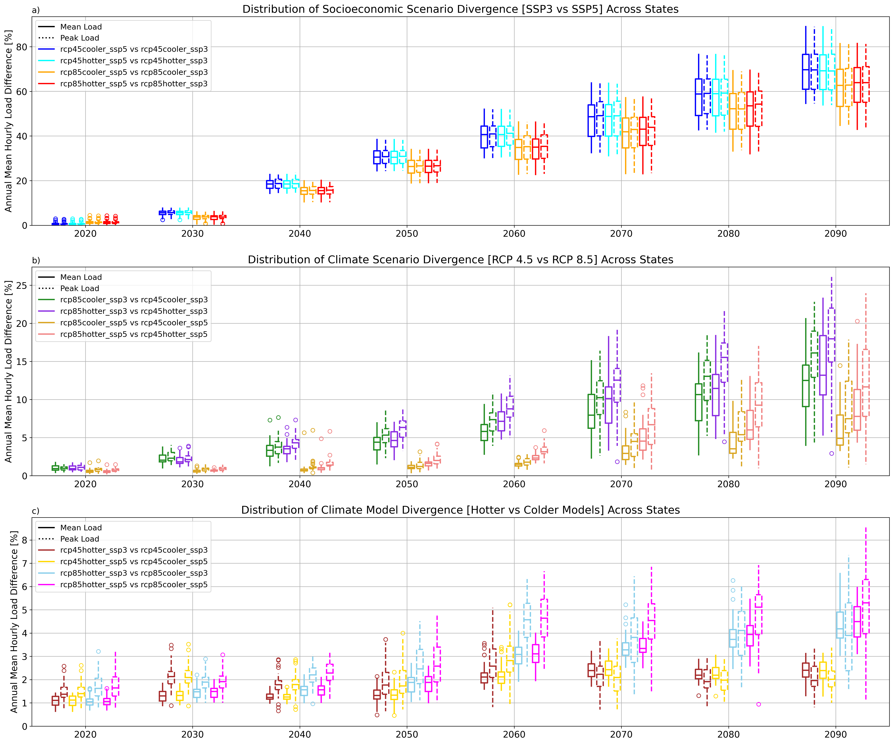
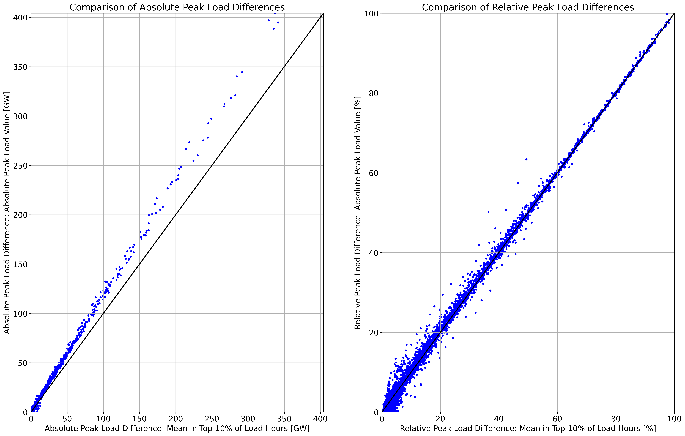

# burleyson-etal_2024_applied_energy

**When Do Different Scenarios of Projected Electricity Demand Start to Meaningfully Diverge?**

Casey D. Burleyson1\*, Zarrar Khan1,2, Misha Kulshresta1,3,4, 
Nathalie Voisin1,4, and Jennie S. Rice1

1  Pacific Northwest National Laboratory, Richland, WA, USA  
2  Joint Global Change Research Institute, College Park, MD, USA  
3  University of California - Santa Barbara, Santa Barbara, CA, USA  
4  University of  Washington, Seattle, WA, USA  

\* corresponding author: casey.burleyson@pnnl.gov

## Abstract
Resource adequacy studies look at balancing electricity supply and demand on 10- to 15-year time horizons while asset 
investment planning typically evaluates returns on 20- to 40-year time horizons. Projections of electricity demand are 
factored into the decision-making in both cases. Climate, energy policy, and socioeconomic changes are key uncertainties 
known to influence electricity demands, but their relative importance for demands over the next 10-40 years is unclear. 
The power sector would benefit from a better understanding of the need to characterize these uncertainties for resource 
adequacy and investment planning. In this study, we quantify when projected United States (U.S.) electricity demands 
start to meaningfully diverge in response to a range of climate, energy policy, and socioeconomic drivers. We use a wide 
yet plausible range of 21st century scenarios for the U.S. The projections span two population/economic growth scenarios 
(Shared Socioeconomic Pathways 3 and 5) and two climate/energy policy scenarios, one including climate mitigation 
policies and one without (Representative Concentration Pathways 4.5 and 8.5). Each climate/energy policy scenario has 
two warming levels to reflect a range of climate model uncertainty. We show that the socioeconomic scenario matters 
almost immediately – within the next 10 years, the climate/policy scenario matters within 25-30 years, and the climate 
model uncertainty matters only after 50+ years. This work can inform the power sector working to integrate climate 
change uncertainties into their decision-making.

## Journal reference
Burleyson, C.D., Z. Khan, M. Kulshresta, N. Voisin, and J.S. Rice (2024). When do different scenarios of projected 
electricity demand start to meaningfully diverge? In revision in *Applied Energy* - February 2024.

## Code reference
Burleyson, C.D., Z. Khan, M. Kulshresta, N. Voisin, and J.S. Rice (2024). Supporting code for Burleyson et al. 2024 - 
Applied Energy [Code]. Zenodo. https://doi.org/10.5281/zenodo.10278502.

## Data references
### Input data
|       Dataset       |               Repository Link                |               DOI                |
|:-------------------:|:--------------------------------------------:|:--------------------------------:|
|   GCAM-USA Output   | https://data.msdlive.org/records/43sy2-n8y47 | https://doi.org/10.57931/1989373 |
| TGW Weather Forcing | https://data.msdlive.org/records/cnsy6-0y610 | https://doi.org/10.57931/1960530 |

### Output data
The output of the TELL model is stored in the data repository linked below. The post-processed files (resulting from the
analysis scripts itemized below) are stored in the /data directory in this meta-repository.

|       Dataset       |                                Repository Link                                |                   DOI                   |
|:-------------------:|:-----------------------------------------------------------------------------:|:---------------------------------------:|
|     TELL Output     |                 https://data.msdlive.org/records/r0rvc-kjw89                  |    https://doi.org/10.57931/2228460     |
| Post-Processed Data | https://github.com/IMMM-SFA/burleyson-etal_2023_applied_energy/tree/main/data | https://doi.org/10.5281/zenodo.10278502 |

## Contributing modeling software
|  Model   | Version |         Repository Link          | DOI |
|:--------:|:-------:|:--------------------------------:|:---:|
| GCAM-USA |  v5.3   | https://data.msdlive.org/records/r52tb-hez28 | https://doi.org/10.57931/1960381 |
|   TELL   |  v1.1   | https://github.com/IMMM-SFA/tell | https://doi.org/10.5281/zenodo.8264217 |

## Reproduce my experiment
Clone this repository to get access to the notebooks used to execute the TELL runs for this experiment. You'll also need 
to download the input files from the accompanying data repository (https://doi.org/10.57931/2228460) and the weather 
forcing data (https://doi.org/10.57931/1960530). Once you have the input datasets downloaded you can use the following 
notebooks to rerun the TELL model and produce the post-processed data used in this analysis. For the TELL runs you 
should only have to adjust the input directories to reflect the paths to wherever you choose to store the input files. 
The accompanying data repository already contains the output from the TELL model so you can skip rerunning the TELL 
model if you want to save time.

|                Script Name                 |                                Description                                 |
|:------------------------------------------:|:--------------------------------------------------------------------------:|
|        tell_runs_exp_group_b.ipynb         | Runs the TELL model based on the GCAM-USA outputs and TGW weather forcing  |
 | interconnection_time_series_analysis.ipynb |   Processes the time series of annual and total loads by interconnection   |
|       ba_time_series_analysis.ipynb        | Processes the time series of annual and total loads by Balancing Authority |
|      state_time_series_analysis.ipynb      |        Processes the time series of annual and total loads by state        |
|        ba_divergence_analysis.ipynb        |     Processes the pairwise scenario differences by Balancing Authority     |
|      state_divergence_analysis.ipynb       |            Processes the pairwise scenario differences by state            |
|        ba_peakiness_analysis.ipynb         |       Processes the change in load peakiness by Balancing Authority        |

## Reproduce my figures
Use the following notebooks to reproduce the main and supplementary figures used in this publication.

| Figure Numbers |                Script Name                 |                                  Description                                   | 
|:--------------:|:------------------------------------------:|:------------------------------------------------------------------------------:|
|       2        |        difference_calculation.ipynb        |             Shows how the mean and peak differences are calculated             |
|       3        | interconnection_time_series_analysis.ipynb |   Analyzes the time series of annual total and peak loads by interconnection   |
|       4        |       ba_time_series_analysis.ipynb        | Analyzes the time series of annual total and peak loads by Balancing Authority |
|  Supplemental  |      state_time_series_analysis.ipynb      |        Analyzes the time series of annual total and peak loads by state        |
|      5, 6      |        ba_divergence_analysis.ipynb        |       Analyzes the pairwise scenario differences by Balancing Authority        |
|       7        |      state_divergence_analysis.ipynb       |              Analyzes the pairwise scenario differences by state               |
|       8        |        peakiness_calculation.ipynb         |              Shows how the change in load peakiness is calculated              |
|       9        |        ba_peakiness_analysis.ipynb         |          Analyzes the change in load peakiness by Balancing Authority          |
|  Supplemental  |      plot_ba_service_territory.ipynb       |            Plots the service territory for each Balancing Authority            |

## Supplemental figures
These landing pages show the complete results for each state and Balancing Authority (BA).

[State-Level Analyses](States_Analysis.md)  
[BA-Level Analyses](Balancing_Authorities_Analysis.md)

Random other figures that might be useful:

|                Description                 |                                        Figure                                         |
|:------------------------------------------:|:-------------------------------------------------------------------------------------:|
|   Approximate interconnection boundaries   |  |
|   Normalized interconnection time series   |  |
|        State load change box plots         |              |
|         State divergence box plots         |          |
| Comparison of peak load definition methods |        |
