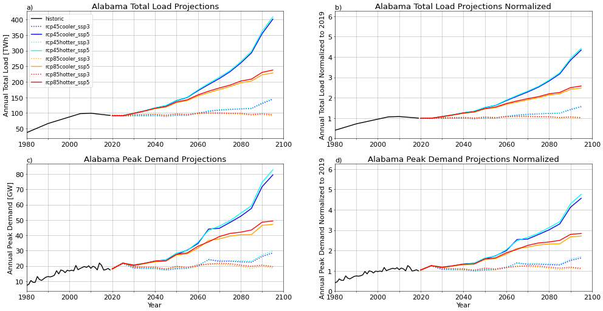

# State Level Analyses
>
## Purpose
This analysis looks at the evolution of annual total demand for electricity for each state.
>
## Analyses
>
| Name | Time Series Analyses |
| :-: | :-: |
| Alabama |  |
| Arkansas |  |
| Arizona |  |
| California |  |
| Colorado |  |
| Connecticut |  |
| District of Columbia |  |
| Delaware |  |
| Florida |  |
| Georgia |  |
| Hawaii |  |
| Iowa |  |
| Idaho |  |
| Illinois |  |
| Indiana |  |
| Kansas |  |
| Kentucky |  |
| Louisiana |  |
| Massachusetts |  |
| Maryland |  |
| Maine |  |
| Michigan |  |
| Minnesota |  |
| Missouri |  |
| Mississippi |  |
| Montana |  |
| North Carolina |  |
| North Dakota |  |
| Nebraska |  |
| New Hampshire |  |
| New Jersey |  |
| New Mexico |  |
| Nevada |  |
| New York |  |
| Ohio |  |
| Oklahoma |  |
| Oregon |  |
| Pennsylvania |  |
| Rhode Island |  |
| South Carolina |  |
| South Dakota |  |
| Tennessee |  |
| Texas |  |
| Utah |  |
| Virginia |  |
| Vermont |  |
| Washington |  |
| Wisconsin |  |
| West Virginia |  |
| Wyoming |  |
